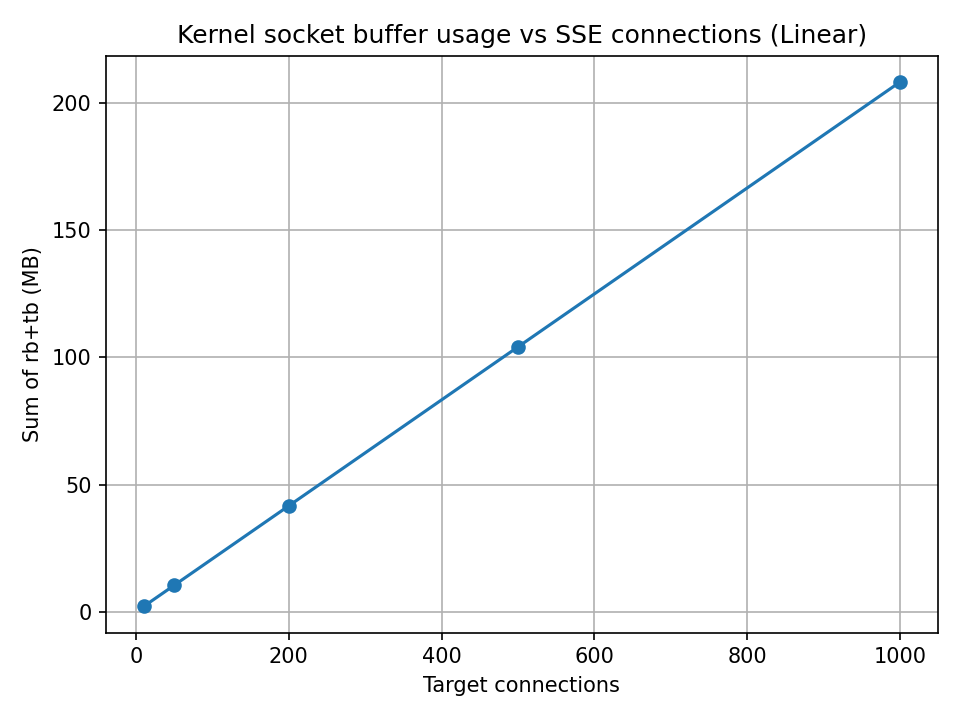

# Baseline Memory Characteristics of SSE Connections (Linux Defaults)

We performed controlled benchmarking of an Axum-based SSE endpoint under default Linux TCP configuration.
This setup includes no event sending, only open idle SSE connections. This gives us a baseline for TCP level requirements before sending any data.

## Summary

Streaming server that can deal with 600K clients will require ~130GB memory running on untuned Linux systems and potentially ~24GB memory running on tuned systems with tradeoffs that require real life workloads to validate.

## Key findings

With default kernel TCP buffer settings, each idle SSE connection consumes approximately ~220 KB of kernel socket buffer memory.

Observed slope:

~218 MB kernel socket buffer usage at 1,000 connections

~220 KB per connection

Extrapolated:

100,000 connections → ~22 GB kernel memory

**600,000 connections → ~132 GB kernel memory**

This scaling behavior is linear and predictable under idle conditions.

Importantly, this memory is not Rust heap memory; it is kernel-managed TCP buffer allocation.

## Details

Linux default TCP settings allocate relatively large buffer sizes per connection (often ~212 KB send + receive defaults via autotuning).

These defaults are optimized for general throughput and large data flows, not high-fanout, mostly-idle streaming connections.

SSE workloads typically:

Maintain long-lived idle connections

Transmit small periodic heartbeats

Occasionally send moderately sized JSON payloads

As such, default TCP buffer sizes are oversized for this workload.

### Potential Mitigation via Kernel Tuning

Reducing default TCP buffer sizes can significantly reduce per-connection memory cost.

Example tuning:

Default buffers: 64 KB

Max buffers: 256–512 KB

Under such configuration, per-connection memory may drop to approximately 40–100 KB, depending on traffic patterns.

At ~40 KB per connection:

**600,000 connections → ~24 GB kernel memory**

This makes high fan-out scenarios materially more feasible.

## Risks and Open Questions

Kernel tuning introduces trade-offs:

### Slow-reading clients

Smaller buffers mean less tolerance for slow consumers. Write backpressure may occur sooner, growing socket buffers to max and slowing down writes across the system.

### Large event payloads

Occasional large JSON updates (e.g. ~100–200 KB) may require multiple RTTs to drain. This can increase latency for slow networks.

### Burst traffic

Multiple updates in short succession may accumulate in Kernel send buffers, causing kernel socket memory growth.

### Application-level queues (if unbounded)

Autotuning behavior - Linux may dynamically grow buffers up to configured max under certain conditions.

## Architecture considerations

This means as a percentage holding metadata about connected streaming clients are likely to be small, leaving open doors to optimize along CPU lines rather than memory.